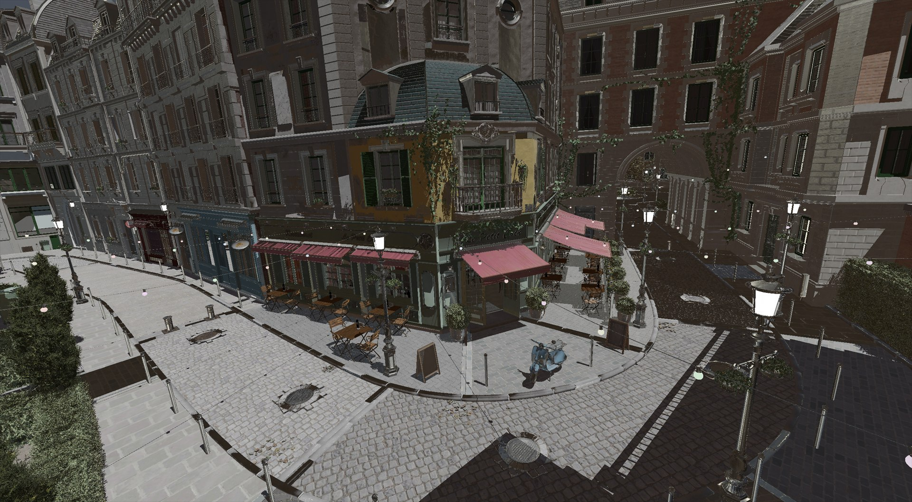
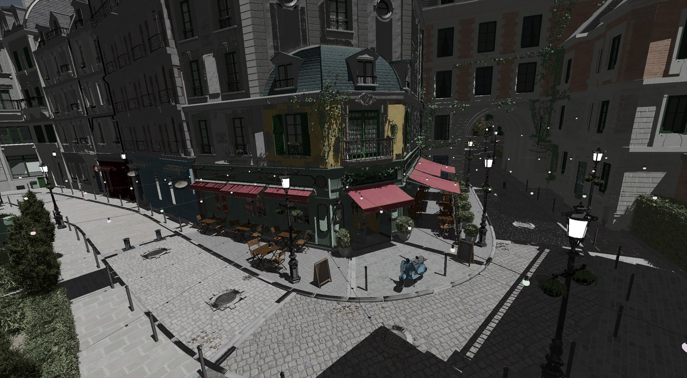
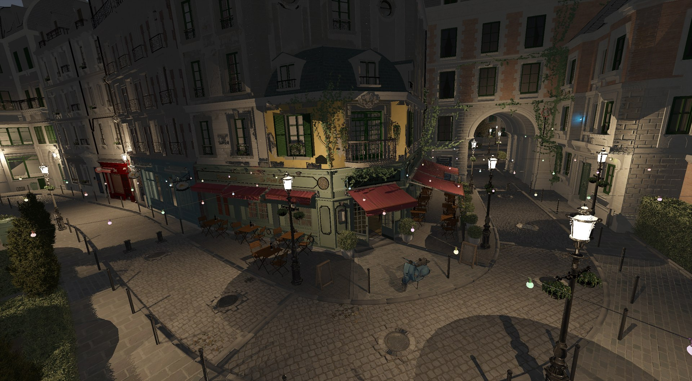
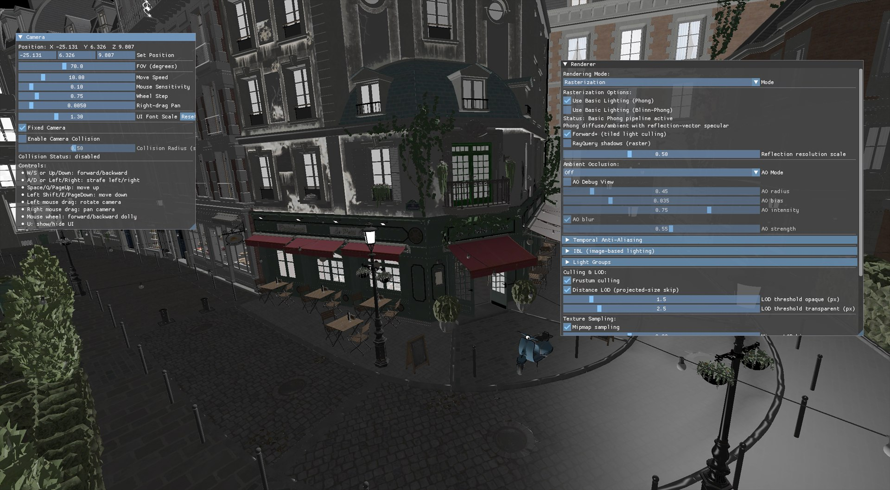

<div align="center">

# VKPBR

**A real-time Vulkan renderer for PBR, hybrid Ray Query effects, IBL and temporal reconstruction**

[English](README.md) | [简体中文](README_zh-CN.md)


</div>

VKPBR is a C++20 desktop renderer built to explore modern real-time rendering with Vulkan. Starting from the Apache-2.0 **Building a Simple Game Engine** material in the Khronos Vulkan Tutorial, this repository extends the renderer with a glTF asset pipeline, raster and compute Ray Query paths, tiled light culling, image-based lighting, ambient occlusion, temporal anti-aliasing, and an interactive ImGui control surface.

## Highlights

- **Two rendering paths:** switch at runtime between rasterization and a compute Ray Query path; supported devices build BLAS/TLAS acceleration structures on demand.
- **glTF PBR pipeline:** glTF/GLB scenes, metallic-roughness and specular-glossiness workflows, normal/occlusion/emissive textures, alpha modes, transmission, cameras, lights, instancing, and transform animation.
- **Hybrid ray effects:** configurable shadows, multi-sample soft shadows, reflections, transparency/refraction, secondary bounces, and an optional thick-glass absorption model.
- **Scalable lighting:** Forward+ tiled light culling, GPU light lists, named light groups, and day/night controls for the Bistro scene.
- **Image-based lighting:** HDR equirectangular input is converted on the GPU into an environment cubemap, diffuse irradiance map, specular prefilter map, and BRDF integration LUT.
- **Screen-space and temporal effects:** SSAO, GTAO, bilateral AO blur, TAA reprojection, depth rejection, neighborhood clipping, sharpening, and dedicated debug views.
- **Runtime asset handling:** asynchronous texture streaming, KTX2/BasisU support, mipmap generation, anisotropic sampling, loading progress, and deferred Vulkan resource destruction.
- **Visibility and diagnostics:** CPU frustum culling, projected-size distance LOD, transparent sorting, fixed-camera comparisons, and live renderer/camera controls through ImGui.

## Gallery



<p align="center"><b>Ray Query · Day</b><br>Hard shadows, reflections/refraction and Split-Sum HDR IBL.</p>

<table>
  <tr>
    <td width="50%"></td>
    <td width="50%"></td>
  </tr>
  <tr>
    <td align="center"><b>Ray Query · Direct Lighting</b><br>Hard shadows with reflection and refraction queries</td>
    <td align="center"><b>Ray Query · Night</b><br>Street-light groups, local shadows and mipmap sampling</td>
  </tr>
</table>

<details>
<summary><b>Live raster and camera controls</b></summary>
<br>

<p align="center">Raster Phong baseline, fixed camera, culling/LOD and texture-sampling controls.</p>
</details>

The captures use the same camera position so lighting changes can be compared directly. TAA is intentionally not represented by a still-image comparison because its main benefit is temporal stability during motion.

## Rendering Pipeline

```text
glTF / GLB scene + HDR environment
                │
                ▼
 Mesh, material, texture and light extraction
                │
        ┌───────┴────────┐
        ▼                ▼
 Rasterization      BLAS / TLAS build
 depth + PBR       compute Ray Query
        │                │
        └───────┬────────┘
                ▼
       SSAO / GTAO → TAA
                │
                ▼
      tone mapping → swapchain
                │
                ▼
        ImGui live diagnostics
```

The raster path supports basic Phong/Blinn-Phong comparisons and a GGX-style PBR path. The Ray Query path uses Vulkan acceleration structures from compute shaders for visibility, reflection, and refraction queries. Both paths feed the same AO, temporal reconstruction, and presentation stages, making fixed-camera A/B comparisons possible from the UI.

## Build and Run

### Requirements

- Windows 10/11
- A Vulkan 1.3 GPU and current graphics driver
- CMake 3.28 or newer and Ninja
- A C++20 compiler; the included preset uses MSYS2 MinGW-w64 GCC
- GLFW, GLM, tinygltf, KTX, and Vulkan development packages
- `slangc`; the local preset expects it under `.tools/`, or it can be supplied by the Vulkan SDK

Rasterization remains available when the optional `VK_KHR_ray_query` and `VK_KHR_acceleration_structure` features are missing. Ray Query mode requires both extensions, buffer device address support, and shader `int64` support.

### Command line

```powershell
git clone https://github.com/YiiiFun/VKPBR.git
cd VKPBR

cmake --preset mingw64
cmake --build --preset mingw64-debug
.\build\mingw64\bin\SimpleEngine.exe
```

The checked-in preset assumes MSYS2 is installed at `C:\msys64\mingw64`. If your toolchain or Vulkan SDK lives elsewhere, update `CMakePresets.json` before configuring. The post-build step copies shaders, assets, and required MinGW runtime DLLs beside the executable.

### VS Code

Open the repository root in VS Code and select **Debug VKPBR (MinGW64)**. The included launch configuration runs the CMake configure/build task before starting GDB. Tool paths in `.vscode/tasks.json`, `.vscode/launch.json`, and `.vscode/settings.json` may need to be adjusted on another machine.

## Runtime Controls

| Control | Purpose |
| --- | --- |
| `W/A/S/D`, `Space`, `Shift` | Fly the camera |
| Left mouse drag | Rotate the camera |
| Right mouse drag | Pan the camera |
| Mouse wheel | Dolly forward or backward |
| `U` | Show or hide the ImGui interface |
| **Mode** | Switch between rasterization and Ray Query when supported |
| **Fixed Camera** | Freeze the viewpoint for repeatable comparisons |
| **AO Mode** | Select Off, SSAO, or GTAO |
| **TAA debug view** | Inspect final lighting, motion vectors, history weight, or disocclusion |
| **IBL debug view** | Inspect the environment, irradiance, prefilter map, or BRDF LUT |
| **Day/Night preset** | Configure the Bistro light groups in Ray Query mode |

HDR IBL and TAA start disabled, providing a stable baseline before either effect is enabled from the Renderer panel.

The default model path is selected in [`main.cpp`](main.cpp). Alternative sample scenes are already listed beside the Bistro load call and can be enabled one at a time.

## Project Structure

```text
.
├── main.cpp                     # Entry point and default scene selection
├── engine.*                     # Main loop, entities, camera input and UI
├── renderer*.cpp / renderer.h   # Vulkan renderer split by responsibility
├── model_loader.*               # glTF/GLB materials, meshes, lights and animation
├── scene_loading.*              # Background scene construction and upload staging
├── resource_manager.*           # Texture jobs and resource lifetime management
├── shaders/                     # Slang raster, compute, AO, IBL and TAA shaders
├── Assets/                      # Test scenes, textures and HDR environment
├── CMake/                       # Dependency find modules
├── external/                    # Vendored tinygltf and stb headers
├── imgui/                       # Dear ImGui sources
├── Courses/                     # Optional feature modules; disabled by default
└── docs/images/                 # README screenshots and capture checklist
```

## Prerequisite Knowledge

- [Khronos Vulkan Tutorial](https://docs.vulkan.org/tutorial/latest/00_Introduction.html)
- [Vulkan Ray Queries](https://docs.vulkan.org/spec/latest/chapters/raytraversal.html)
- [glTF 2.0 Specification](https://registry.khronos.org/glTF/specs/2.0/glTF-2.0.html)
- [Physically Based Rendering — Filament](https://google.github.io/filament/Filament.html)

## Scope

This is a learning and portfolio renderer, not a general-purpose game engine or scene editor. The current code targets desktop Vulkan 1.3, loads a scene selected at compile time, and exposes rendering experiments through ImGui. Ray Query support is hardware-dependent, planar reflections are disabled, and the optional course modules are excluded by the default build preset.

## License and Attribution

The main source and shader files retain their original Holochip Corporation copyright and Apache-2.0 SPDX headers. Project-specific modifications are distributed under the same Apache-2.0 terms; see [`LICENSE`](LICENSE) and [`NOTICE`](NOTICE). Do not remove those headers when redistributing the source.

Third-party libraries and assets keep their own licenses. See [`THIRD_PARTY_ASSETS.md`](THIRD_PARTY_ASSETS.md) and the license files stored beside individual dependencies and models.
